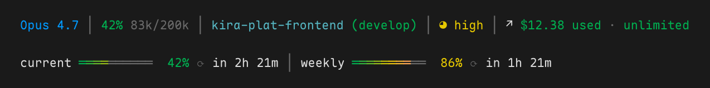

# claude-statusline

A statusline for [Claude Code](https://github.com/anthropics/claude-code) with a color-graded live session effort badge, smooth per-cell RGB gradient progress bars for 5h / weekly usage, worktree-aware path truncation, and an inline overage-credits segment.

Pure bash + `jq` + `curl`. Doesn't require any particular shell or prompt tool — runs the same under zsh, bash, fish, Ghostty, iTerm, Terminal.app, anything that hosts Claude Code.



## Features

- **Live session effort** — reads the live `effort.level` from the statusline JSON (`low` / `medium` / `high` / `xhigh` / `max`), color-graded along a `grey → green → yellow → orange → red` attention ramp with a circle-fill glyph progression `◔ / ◑ / ◕ / ● / ●`. Falls back to the persisted `~/.claude/settings.json` `effortLevel` when the current model does not expose live effort.
- **Smooth gradient progress bars** — per-cell RGB interpolation along `green → yellow → orange → red`, rendered with the box-drawing `═` extender so adjacent cells tile edge-to-edge with no seams.
- **Worktree-aware paths** — in worktree mode the redundant dirname is suppressed (it duplicates the worktree slug), the implicit `user/` prefix is stripped from the branch, and long names get a p10k-style middle ellipsis (`BRANCH_CAP=28`, `DIR_CAP=24`).
- **Inline overage credits** — the API's `extra_usage` field (Anthropic's pay-as-you-go credits spent beyond the subscription quota, distinct from the 5h / weekly subscription bars) sits on line 1, marked with a `↗` arrow, alongside model / context / dir / effort. No third row.
- **Background usage cache** — fetches `api.anthropic.com/api/oauth/usage` on a 60-second schedule from a detached subshell, so renders never block on the network; a stale lock dir is auto-reclaimed if a refresh dies before cleanup.
- **Multi-fallback OAuth token resolution** — macOS Keychain (`Claude Code-credentials`) → `~/.claude/.credentials.json` → Linux `secret-tool`. Honors `CLAUDE_CODE_OAUTH_TOKEN` for ad-hoc overrides.

## Requirements

- [`jq`](https://jqlang.github.io/jq/), [`curl`](https://curl.se/), [`git`](https://git-scm.com/).
- Claude Code recent enough to expose `effort.level` in the statusline JSON. See [`anthropics/claude-code`](https://github.com/anthropics/claude-code) for current versions.

On macOS (install [Homebrew](https://brew.sh) first if you don't have it — `brew` is not bundled with macOS):

```bash
brew install jq
```

## Recommended font

The statusline relies on Unicode glyphs that look best in a font with good box-drawing and Nerd Font coverage: the gradient bars use `═` (double horizontal box-drawing extender), the effort badge cycles through `◔ / ◑ / ◕ / ●`, and the dir / overage / refresh segments use `⎇`, `↗`, `⟳`, `│`. Any reasonable monospace font with full Unicode coverage works; the rendering in this repo is captured with **[Maple Mono NF CN](https://font.subf.dev/en/)** (Nerd Font + CJK variant), installable on macOS via:

```bash
brew install --cask font-maple-mono-nf-cn
```

## Install

One-liner (downloads `statusline.sh`, backs up your current `~/.claude/settings.json`, then merges in the `statusLine` block):

```bash
curl -fsSL https://raw.githubusercontent.com/terrence-kira/claude-statusline/main/install.sh | bash
```

Restart Claude Code (`exit`, then `claude`) for the new statusline to take effect.

To remove:

```bash
curl -fsSL https://raw.githubusercontent.com/terrence-kira/claude-statusline/main/uninstall.sh | bash
```

<details>
<summary>Manual install (if you'd rather not pipe to bash)</summary>

```bash
mkdir -p ~/.claude
curl -fsSL https://raw.githubusercontent.com/terrence-kira/claude-statusline/main/statusline.sh \
  -o ~/.claude/statusline.sh
chmod +x ~/.claude/statusline.sh
```

Then add the `statusLine` block to `~/.claude/settings.json`:

```json
{
  "statusLine": {
    "type": "command",
    "command": "~/.claude/statusline.sh",
    "padding": 0,
    "refreshInterval": 1000
  }
}
```

Restart Claude Code (`exit`, then `claude`) for the new statusline to take effect.

</details>

## Troubleshooting

- **Rate-limit bars stay at zero.** The 5h / weekly bars require a valid Claude Code OAuth token; the script reads it from macOS Keychain, `~/.claude/.credentials.json`, or `secret-tool` in that order. If you use a non-standard credential store, export `CLAUDE_CODE_OAUTH_TOKEN` in your shell before launching Claude Code.
- **`User-Agent` rejected by the usage endpoint.** The script sends a pinned Claude Code user-agent string against `api.anthropic.com/api/oauth/usage`. If Anthropic ever rejects stale agents, bump the version literal in `statusline.sh` to match your installed Claude Code (`claude --version`).

## Credits

Inspired by and originally forked from [`kamranahmedse/claude-statusline`](https://github.com/kamranahmedse/claude-statusline). The script in this repo has been substantially rewritten; the npm-distributed installer has been intentionally dropped in favor of a single auditable bash file.

## License

[MIT](./LICENSE). Portions originally from `kamranahmedse/claude-statusline` (MIT, © Kamran Ahmed).
